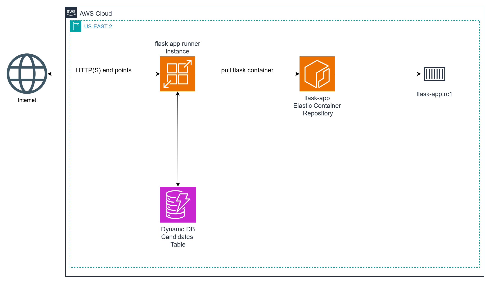
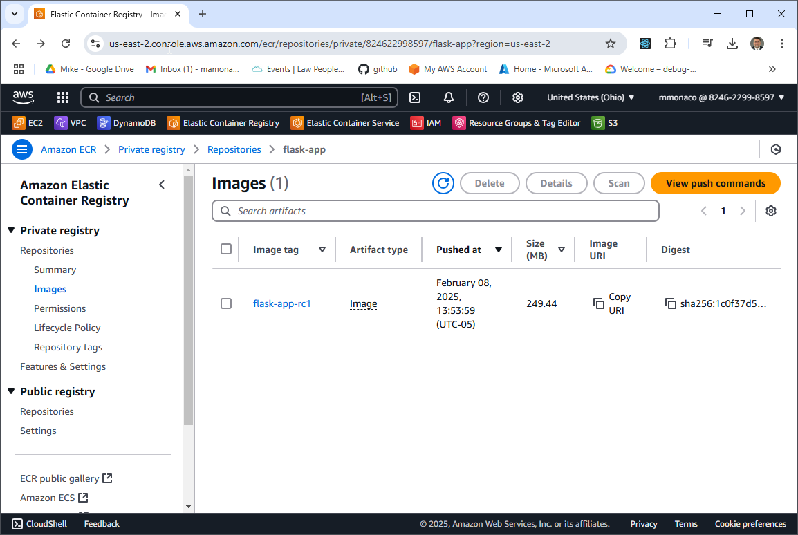
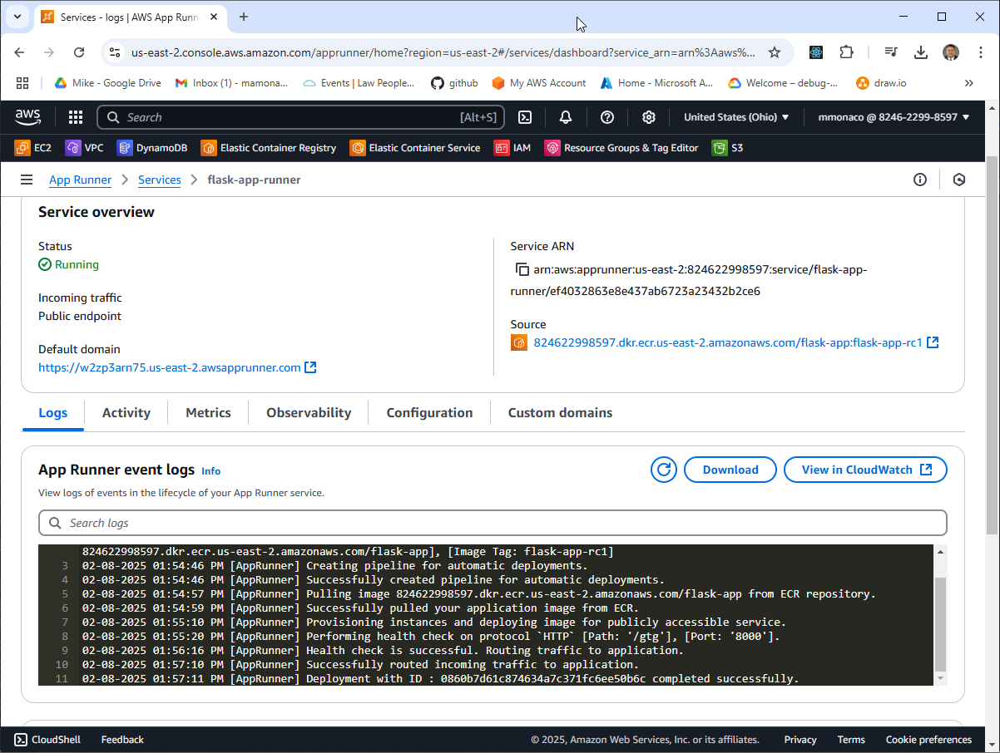

# Deploying Simple Containers in AWS

Welcome to **Video 1** of the [Simple Containers Series](https://www.youtube.com/@MikesCloudSolutions), where we’ll focus on containerizing a Python-based microservice and deploying it on **AWS App Runner**. This video complements the [AWS Autoscaling](https://www.youtube.com/watch?v=aBMM6vjC8d0) video, where we deployed Flask microservices using **EC2 instances** and **Auto Scaling Groups**. That same microservice will be packaged as a container and deployed with **AWS App Runner**.

### In This Video, We'll:

- Use **DynamoDB** for persistent data storage 
- **Containerize** the Python microservice using **Docker**  
- **Push** the container image to **Amazon Elastic Container Registry (ECR)**  
- **Deploy** the container using **AWS App Runner**  
   
## **Amazon ECR: Simplifying Container Image Management**

**Amazon Elastic Container Registry (ECR)** is a fully managed Docker container registry provided by AWS. It allows you to store, manage, and deploy container images securely and at scale. ECR integrates seamlessly with AWS services like **App Runner**, **ECS**, and **EKS**, making it easy to deploy containerized applications.

### **Key Features:**
- **Private & Public Repositories:** Store container images securely with fine-grained access control.
- **Integration with CI/CD:** Easily integrates with GitHub Actions, AWS CodePipeline, and Jenkins for automated deployments.
- **High Availability:** AWS manages replication, durability, and scaling behind the scenes.
- **Security:** Supports encryption at rest and in transit, plus IAM-based access control.

### **How It Works:**
1. **Build** your Docker image locally or in a CI/CD pipeline.
2. **Tag** the image with your ECR repository URL.
3. **Push** the image to ECR using Docker CLI or automation tools.
4. **Pull** the image from ECR to deploy in services like App Runner, ECS, or EKS.

## **AWS App Runner: Effortless Deployment for Containerized Applications**

**AWS App Runner** is a fully managed service that makes it easy to deploy and run containerized web applications and APIs without managing servers. App Runner abstracts away infrastructure management, handling scaling, load balancing, and deployments automatically.

### **Key Features:**
- **Simple Deployment:** Deploy directly from ECR, GitHub, or a container registry with minimal configuration.
- **Automatic Scaling:** Automatically scales up or down based on incoming traffic, including scaling to zero during idle periods.
- **Built-in Load Balancing:** Distributes incoming requests without the need to configure a separate load balancer.
- **Secure by Default:** Supports HTTPS endpoints, environment variables encryption, and IAM roles for secure access to AWS services.

### **How It Works:**
1. **Source:** Connect to a container image from ECR or a source code repository (App Runner builds it for you).
2. **Configure:** Set runtime settings like environment variables, CPU/memory limits, and deployment policies.
3. **Deploy:** App Runner handles provisioning, load balancing, scaling, and monitoring automatically.
4. **Manage:** Monitor logs, metrics, and scale settings via the AWS Console or CLI.



## Prerequisites

* [An AWS Account](https://aws.amazon.com/console/)
* [Install AWS CLI](https://docs.aws.amazon.com/cli/latest/userguide/getting-started-install.html) 
* [Install Latest Terraform](https://developer.hashicorp.com/terraform/install)
* [Install Postman](https://www.postman.com/downloads/) for testing
* [Install Docker](https://docs.docker.com/engine/install/)

If this is your first time watching our content, we recommend starting with this video: [AWS + Terraform: Easy Setup](https://youtu.be/BCMQo0CB9wk). It provides a step-by-step guide to properly configure Terraform, Packer, and the AWS CLI.

## Download this Repository

```bash
git clone https://github.com/mamonaco1973/aws-flask-container.git
cd aws-flask-container
```

## Build the Code

Run [check_env](check_env.sh) then run [apply](apply.sh).

```bash
~/aws-flask-container$ ./apply.sh
NOTE: Validating that required commands are found in your PATH.
NOTE: aws is found in the current PATH.
NOTE: docker is found in the current PATH.
NOTE: terraform is found in the current PATH.
NOTE: All required commands are available.
NOTE: Checking AWS cli connection.
NOTE: Successfully logged into AWS.
NOTE: Building ECR Instance.
Initializing the backend...
Initializing provider plugins...
- Finding latest version of hashicorp/aws...
- Installing hashicorp/aws v5.86.0...
[...]
```

### **Build Process Overview**

The build process consists of three distinct phases:

#### 1. Build the ECR Instance
- Creates an Amazon Elastic Container Registry (ECR) using Terraform to store Docker images.

#### 2. Build the Docker Image and Push it
- Builds the Flask Docker container and pushes the image to the ECR repository.

#### 3. Build the AWS App Runner Instance
- Deploys the Flask container to AWS App Runner using Terraform.

#### Final Validation
- After the build completes, the `test_candidates.py` script is run to verify the solution and ensure everything is functioning as expected.

## Tour of Build Output in the AWS Console

- **The ECR Instance**



- **The App Runner Instance**



## Flask Endpoint Summary

- [Source Code](./02-docker/app.py)

### `/gtg` (GET)
- **Purpose**: Health check.
- **Response**: 
  - `{"connected": "true", "instance-id": <instance_id>}` (if `details` query parameter is provided).
  - 200 OK with no body otherwise.

### `/candidate/<name>` (GET)
- **Purpose**: Retrieve a candidate by name.
- **Response**: 
  - Candidate details (JSON) with status `200`.
  - `"Not Found"` with status `404` if no candidate is found.

### `/candidate/<name>` (POST)
- **Purpose**: Add or update a candidate by name.
- **Response**: 
  - `{"CandidateName": <name>}` with status `200`.
  - `"Unable to update"` with status `500` on failure.

### `/candidates` (GET)
- **Purpose**: Retrieve all candidates.
- **Response**: 
  - List of candidates (JSON) with status `200`.
  - `"Not Found"` with status `404` if no candidates exist.