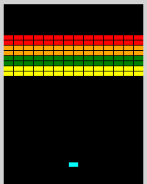

# Containerizing Applications with Amazon EKS (Elastic Kubernetes Service)

Welcome to **Video 1** of the [Kubernetes In the Cloud](https://github.com/mamonaco1973/cloud-k8s-intro/blob/main/README.md) series.

**This video complements the [AWS AutoScaling](https://github.com/mamonaco1973/aws-flask-asg/blob/main/README.md) and the [Simple AWS Containers](https://github.com/mamonaco1973/aws-flask-container/blob/main/README.md) projects**, where we deployed a simple Python-based microservice using the Flask framework with different cloud services.

This is a **fully automated deployment** of containerized microservices and web apps with **Amazon EKS (Elastic Kubernetes Service)** — powered by Terraform and shell scripting.

You'll build and deploy:

- **A document database-backed microservice** using:  
  - **Amazon DynamoDB** for fast, serverless NoSQL storage.

- **A Docker container** for the Flask microservice, optimized for deployment to **Amazon EKS**.

- **Additional standalone Docker containers** that run classic JavaScript games like **[Tetris](https://gist.github.com/straker/3c98304f8a6a9174efd8292800891ea1)**, **[Frogger](https://gist.github.com/straker/82a4368849cbd441b05bd6a044f2b2d3)**, and **[Breakout](https://gist.github.com/straker/98a2aed6a7686d26c04810f08bfaf66b)**.

- **Cloud-native container registry workflows**, pushing all images to:  
  - **Amazon ECR (Elastic Container Registry)**.

- **Kubernetes workloads on Amazon EKS**, managing containerized applications at scale.

- **Kubernetes manifests** including **Deployments**, **Services**, and **Ingress** resources for scalable, fault-tolerant workloads.

- **NGINX as a unified Ingress controller**, exposing all services and games behind a single **AWS Load Balancer**.

## Is Amazon EKS PaaS or IaaS?

When deploying Kubernetes with **Amazon Elastic Kubernetes Service (EKS)**, you might ask:

> Is EKS considered Infrastructure as a Service (IaaS) or Platform as a Service (PaaS)?

EKS lets you define compute and scaling options — that sounds like IaaS. But it also manages the Kubernetes control plane, automates provisioning, and abstracts away much of the operational overhead — which leans toward PaaS.

The best answer: **EKS delivers a PaaS-like experience built on IaaS foundations**. It blends declarative APIs with AWS-native infrastructure provisioning.

---

### Managed Control Plane, Declarative Infrastructure

With **EKS**, you never install or operate the Kubernetes control plane. AWS handles all of that for you — including:

- Control plane availability and scaling
- Version upgrades and patching
- Integrated monitoring and security

You don’t manually launch EC2 instances for worker nodes. Instead, you define node group settings, and AWS provisions the necessary compute infrastructure for you — all through a **declarative, hands-off experience** that feels like PaaS.

---

### Load Balancer Provisioning

EKS integrates tightly with AWS load balancing. When you create a Kubernetes `Service` of type `LoadBalancer`, AWS automatically provisions an:

- **Elastic Load Balancer (ELB)** or **Application Load Balancer (ALB)**, depending on annotations.

You don’t need to configure health checks or backend pools — the Kubernetes **cloud controller manager** handles that. This automation is a hallmark of PaaS: describe the service, and the infrastructure follows.

---

### Autoscaling and Node Management: IaaS Under the Hood

While you don’t manage EC2 instances directly, EKS uses **Auto Scaling Groups (ASGs)** to provision and scale worker nodes. You define:

- Node group instance types and sizes  
- Minimum and maximum counts  
- Auto-scaling behavior based on cluster metrics

AWS then manages:

- VM provisioning and health checks  
- Auto-repair and rolling updates  
- Availability zone-aware scheduling

It’s all backed by traditional IaaS — just orchestrated through Kubernetes abstractions.

---

### Tagging: The Glue Behind the Scenes

Amazon EKS uses **resource tagging** extensively to manage cluster components:

- Tags on subnets tell EKS which networks to use for node placement.
- Tags on EC2 instances help the Kubernetes autoscaler track and scale node groups.
- Tags on ELBs and security groups tie resources back to the cluster.

You rarely touch these tags yourself — but they’re essential for EKS to operate in a cloud-native, automated way.

---

### Conclusion

**Amazon EKS delivers a managed Kubernetes experience that blends PaaS simplicity with IaaS flexibility**:

- You don’t install or manage the control plane.
- You define infrastructure declaratively.
- AWS provisions and maintains the underlying EC2-based compute.

Compared to fully abstracted services like **AWS RDS** or **Managed Microsoft AD**, EKS strikes a balance — offering control when you need it, and automation when you don’t.

## AWS Solution

The **EKS solution we are building** consists of a fully managed **Amazon EKS cluster** deployed in the `us-east-2` region.

It includes:

- A fully managed **control plane** provided by AWS
- Two distinct **node groups**:
  - `flask-app` for running the Flask-based microservice
  - `games` for hosting classic JavaScript games like Tetris

Within the cluster, **pods** run containerized applications such as `flask-app-1` and `tetris`, each isolated and scalable.

The solution integrates tightly with essential AWS services:

- **Amazon VPC** for secure, cloud-native networking
- **Amazon ECR** for storing and managing Docker container images
- **Amazon DynamoDB** for fast, serverless NoSQL data storage
- An external **Elastic Load Balancer** for distributing incoming traffic
- An **NGINX Ingress Controller** for routing traffic to individual services within the cluster

All infrastructure is defined using **Terraform**, while application deployment and management are performed using `kubectl`.


This diagram shows the AWS infrastructure behind the EKS cluster, with EC2-based node groups in private subnets, a Network Load Balancer for internet traffic, and connected services like DynamoDB and Elastic Container Registry.


## Prerequisites

* [An AWS Account](https://aws.amazon.com/console/)
* [Install AWS CLI](https://docs.aws.amazon.com/cli/latest/userguide/getting-started-install.html) 
* [Install Latest Terraform](https://developer.hashicorp.com/terraform/install)
* [Install Postman](https://www.postman.com/downloads/) for testing
* [Install Docker](https://docs.docker.com/engine/install/)

If this is your first time watching our content, we recommend starting with this video: [AWS + Terraform: Easy Setup](https://youtu.be/BCMQo0CB9wk). It provides a step-by-step guide to properly configure Terraform, Packer, and the AWS CLI.

## Download this Repository

```bash
git clone https://github.com/mamonaco1973/aws-k8s.git
cd aws-k8s
```
## Build the Code

Run [check_env](check_env.sh) then run [apply](apply.sh).

```bash
OTE: Validating that required commands are found in your PATH.
NOTE: aws is found in the current PATH.
NOTE: docker is found in the current PATH.
NOTE: terraform is found in the current PATH.
NOTE: All required commands are available.
NOTE: Checking AWS cli connection.
NOTE: Successfully logged into AWS.
NOTE: Building ECR Instance.
Initializing the backend...
Initializing provider plugins...
- Finding latest version of hashicorp/aws...
- Installing hashicorp/aws v5.94.1...
[...]
```

### **Build Process Overview**

The build process is organized into four phases:

#### 1. Provision ECR Repositories and VPC
- Creates **Amazon Elastic Container Registry (ECR)** repositories for storing container images.
- Sets up the **Amazon VPC** and networking infrastructure required for the EKS cluster.

#### 2. Build and Push Docker Images
- Builds Docker images for the **Flask microservice** and three **JavaScript game apps** (Tetris, Frogger, Breakout).
- Pushes all images to their respective **ECR repositories**.

#### 3. Provision Amazon EKS Cluster
- Deploys the **Amazon EKS cluster** with two managed node groups:
  - `flask-nodes` for the Flask microservice
  - `game-nodes` for the game containers

#### 4. Deploy Applications Using `kubectl`
- Connects `kubectl` to the newly created EKS cluster.
- Applies Kubernetes manifests:
  - `flask-app.yaml` for the microservice
  - `games.yaml` for the game containers

## Tour of Build Output in the AWS Console


## Service Endpoint Summary

### `/flask-app/api/gtg` (GET)
- **Purpose**: Health check.
- **Response**: 
  - `{"connected": "true", "instance-id": <instance_id>}` (if `details` query parameter is provided).
  - 200 OK with no body otherwise.

### `/flask-app/api/<name>` (GET)
- **Purpose**: Retrieve a candidate by name.
- **Response**: 
  - Candidate details (JSON) with status `200`.
  - `"Not Found"` with status `404` if no candidate is found.

### `/flask-app/api/<name>` (POST)
- **Purpose**: Add or update a candidate by name.
- **Response**: 
  - `{"CandidateName": <name>}` with status `200`.
  - `"Unable to update"` with status `500` on failure.

### `/flask-app/api/candidates` (GET)
- **Purpose**: Retrieve all candidates.
- **Response**: 
  - List of candidates (JSON) with status `200`.
  - `"Not Found"` with status `404` if no candidates exist.

### `/games/tetris` (GET)
 - **Purpose**: Loads javascript tetris game for usage in a Web Browser.

      

### `/games/frogger` (GET)
 - **Purpose**: Loads javascript frogger game for usage in a Web Browser.

      

### `/games/breakout` (GET)
 - **Purpose**: Loads javascript breakout game for usage in a Web Browser.

      